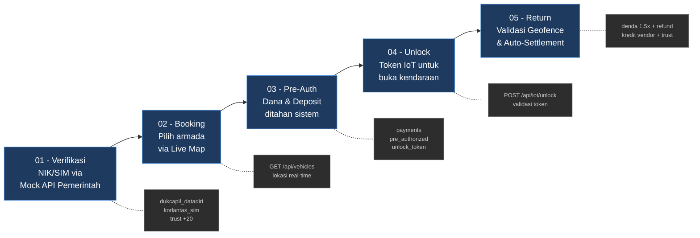
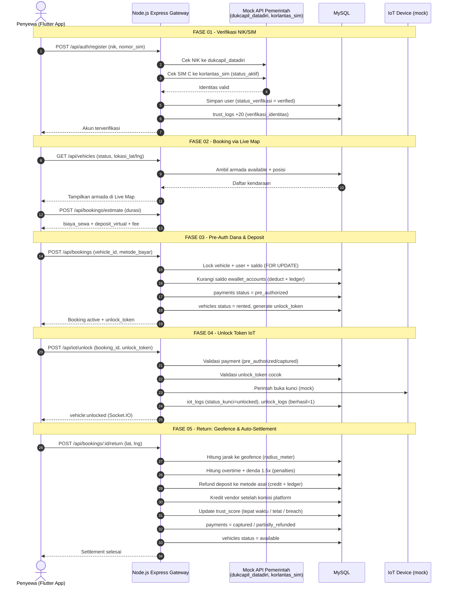
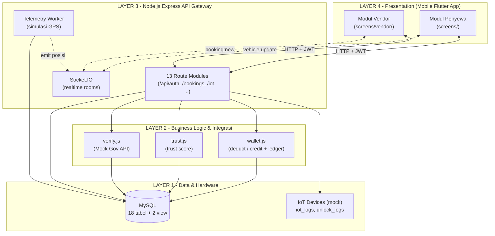
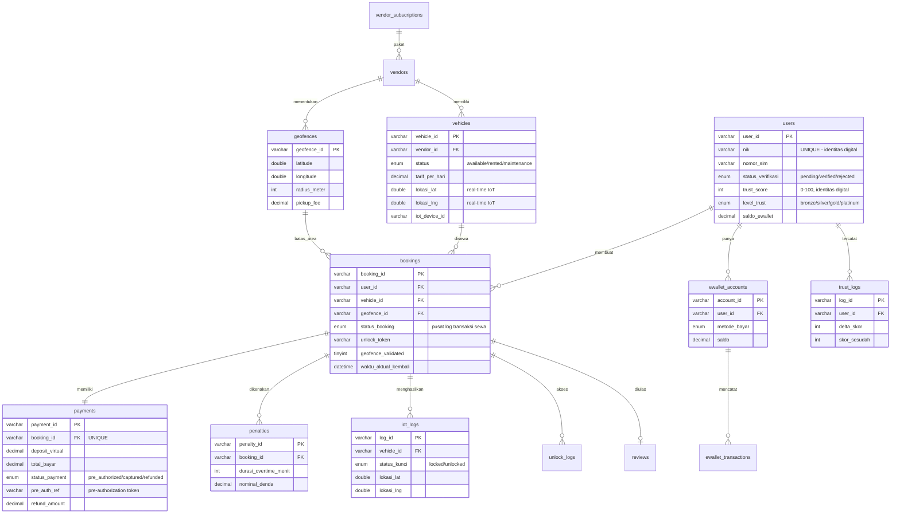
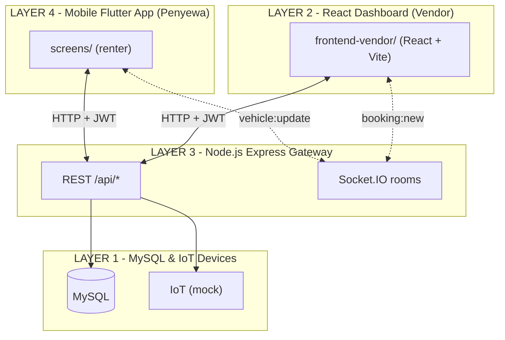

# Diagram Sistem RentHub

Seluruh diagram dibuat berdasarkan analisis kode aktual (`backend/src`, `database/schema.sql`, `frontend/lib`). Istilah teknis sengaja dipertahankan dalam bahasa Inggris.

---

## 1. Alur Bisnis End-to-End

### 1a. Alur Ringkas (5 Fase)

Pipeline tingkat tinggi dari verifikasi sampai settlement.



### 1b. Alur Detail (Sequence)

Diagram urutan (sequence) untuk 5 fase inti, lengkap dengan endpoint dan tabel yang disentuh.



---

## 2. Arsitektur Sistem (Layered)

Pemisahan logic bisnis, interface user, dan integrasi IoT secara modular.



> Catatan: dalam kode, UI vendor adalah modul di dalam app Flutter yang sama (`screens/vendor/`), bukan aplikasi React terpisah. Lihat bagian "Rekonsiliasi" di bawah.

---

## 3. Struktur Database MySQL

ER diagram dengan tabel utama dan relasinya. Empat tabel inti ditandai pada keterangan.



**Keterangan tabel utama:**

| Tabel | Deskripsi |
|-------|-----------|
| `users` | Trust score & identitas digital (NIK, SIM, level_trust) |
| `vehicles` | Status real-time IoT Lat/Lng + status sewa |
| `bookings` | Pusat log transaksi sewa (link user, vehicle, geofence, payment) |
| `payments` | Status pre-authorization & settlement deposit |

---

## Rekonsiliasi dengan Kode (penting untuk laporan)

Tiga hal pada deskripsi tugas yang perlu disesuaikan agar konsisten dengan implementasi:

1. **Pre-Auth (Fase 03).** Istilah "dana ditahan" tidak persis. Di `booking.routes.js:194` sistem menarik penuh `total_bayar` (sewa + deposit + fee) dari `ewallet_accounts` via `deduct()`. Status payment diberi label `pre_authorized`, tetapi saldo sudah benar-benar berkurang. Deposit dikembalikan via `credit()` saat return. Jadi secara teknis ini **capture + escrow deposit**, bukan authorization hold murni. Saran: pada laporan tulis "pembayaran di-capture, deposit di-escrow lalu di-settle".

2. **Layer Vendor.** Kode tidak memiliki React Dashboard. UI vendor adalah modul Flutter (`frontend/lib/screens/vendor/`) dalam aplikasi yang sama dengan penyewa. Diagram arsitektur di atas sudah mencerminkan kondisi nyata. Jika dosen mewajibkan React, itu menjadi rencana pengembangan, bukan kondisi saat ini.

3. **Nama tabel.** Tabel kendaraan bernama `vehicles` (bukan `kendaraan`) sesuai `database/schema.sql:135`.

---

## Elaborasi & Penerapan (jika harus sesuai permintaan)

Bagian ini memperjelas tiga ketidaksesuaian di atas dan memberi langkah penerapan konkret bila deskripsi tugas harus dipenuhi apa adanya.

### A. Pre-Auth: dari "capture langsung" menjadi "hold murni"

**Kondisi kode saat ini.** Alur booking bukan authorization hold, melainkan penarikan penuh:

- `booking.routes.js:136-137` menghitung `depositVirtual` dan `totalBayar` (sewa + deposit + pickup_fee + delivery_fee).
- `booking.routes.js:194` memanggil `deduct(conn, { amount: totalBayar })`, yang di `wallet.js:19-20` benar-benar mengurangi `ewallet_accounts.saldo`. Uang sudah hilang dari saldo user saat itu juga.
- `booking.routes.js:188` menulis `payments.status_payment = 'pre_authorized'`, padahal saldo sudah berkurang. Jadi label tidak mencerminkan keadaan dana.
- Saat return, `booking.routes.js:431` memanggil `credit()` untuk mengembalikan sisa deposit.

Akibatnya, "ditahan" sebenarnya berarti "ditarik penuh lalu sebagian dikembalikan". Tidak ada konsep saldo yang dibekukan tetapi tetap milik user.

**Penerapan agar menjadi hold sungguhan.** Pisahkan saldo tersedia dari saldo tertahan, lalu ganti `deduct` di booking dengan `hold`, dan settle saat return.

1. Skema: tambah kolom saldo tertahan dan tipe transaksi baru.

```sql
-- database/schema.sql
ALTER TABLE ewallet_accounts
  ADD COLUMN saldo_tertahan DECIMAL(12,2) DEFAULT 0 AFTER saldo;

ALTER TABLE ewallet_transactions
  MODIFY COLUMN tipe ENUM('topup','deduct','refund','transfer_out','transfer_in',
                          'hold','capture','release') NOT NULL;
```

2. Helper baru di `wallet.js` (saldo available = `saldo`, dana beku = `saldo_tertahan`):

```js
// wallet.js
// HOLD: pindahkan dana dari saldo -> saldo_tertahan (pre-authorization)
async function hold(conn, { userId, metodeBayar, amount, refBookingId = null, keterangan = '' }) {
  const [rows] = await conn.execute(
    'SELECT account_id, saldo, saldo_tertahan FROM ewallet_accounts WHERE user_id=? AND metode_bayar=? FOR UPDATE',
    [userId, metodeBayar]);
  if (!rows[0]) { const e = new Error('Metode bayar tidak ditemukan'); e.code = 'METHOD_NOT_FOUND'; throw e; }
  const before = parseFloat(rows[0].saldo);
  if (before < amount) { const e = new Error('Saldo tidak mencukupi'); e.code = 'INSUFFICIENT_FUNDS'; throw e; }
  const after = before - amount;
  const tertahan = parseFloat(rows[0].saldo_tertahan) + amount;
  await conn.execute('UPDATE ewallet_accounts SET saldo=?, saldo_tertahan=? WHERE account_id=?',
    [after, tertahan, rows[0].account_id]);
  await conn.execute('UPDATE users SET saldo_ewallet=(SELECT COALESCE(SUM(saldo),0) FROM ewallet_accounts WHERE user_id=?) WHERE user_id=?',
    [userId, userId]);
  await conn.execute(
    `INSERT INTO ewallet_transactions (txn_id, account_id, tipe, amount, saldo_sebelum, saldo_sesudah, ref_booking_id, keterangan)
     VALUES (?,?, 'hold', ?,?,?,?,?)`,
    [uuidv4(), rows[0].account_id, amount, before, after, refBookingId, keterangan]);
  return after;
}

// CAPTURE: ambil dana tertahan secara permanen (settlement sewa + denda)
async function capture(conn, { userId, metodeBayar, amount, refBookingId = null, keterangan = '' }) {
  const [rows] = await conn.execute(
    'SELECT account_id, saldo_tertahan FROM ewallet_accounts WHERE user_id=? AND metode_bayar=? FOR UPDATE',
    [userId, metodeBayar]);
  const tertahan = parseFloat(rows[0].saldo_tertahan) - amount;
  await conn.execute('UPDATE ewallet_accounts SET saldo_tertahan=? WHERE account_id=?', [tertahan, rows[0].account_id]);
  await conn.execute(
    `INSERT INTO ewallet_transactions (txn_id, account_id, tipe, amount, saldo_sebelum, saldo_sesudah, ref_booking_id, keterangan)
     VALUES (?,?, 'capture', ?, ?, ?, ?, ?)`,
    [uuidv4(), rows[0].account_id, amount, tertahan + amount, tertahan, refBookingId, keterangan]);
}

// RELEASE: lepas dana tertahan kembali ke saldo available (deposit dikembalikan)
async function release(conn, { userId, metodeBayar, amount, refBookingId = null, keterangan = '' }) {
  const [rows] = await conn.execute(
    'SELECT account_id, saldo, saldo_tertahan FROM ewallet_accounts WHERE user_id=? AND metode_bayar=? FOR UPDATE',
    [userId, metodeBayar]);
  const before = parseFloat(rows[0].saldo);
  const after = before + amount;
  const tertahan = parseFloat(rows[0].saldo_tertahan) - amount;
  await conn.execute('UPDATE ewallet_accounts SET saldo=?, saldo_tertahan=? WHERE account_id=?',
    [after, tertahan, rows[0].account_id]);
  await conn.execute('UPDATE users SET saldo_ewallet=(SELECT COALESCE(SUM(saldo),0) FROM ewallet_accounts WHERE user_id=?) WHERE user_id=?',
    [userId, userId]);
  await conn.execute(
    `INSERT INTO ewallet_transactions (txn_id, account_id, tipe, amount, saldo_sebelum, saldo_sesudah, ref_booking_id, keterangan)
     VALUES (?,?, 'release', ?, ?, ?, ?, ?)`,
    [uuidv4(), rows[0].account_id, amount, before, after, refBookingId, keterangan]);
  return after;
}

module.exports = { deduct, credit, hold, capture, release };
```

3. Booking: ganti `deduct` menjadi `hold` di `booking.routes.js:194`.

```js
const { deduct, credit, hold, capture, release } = require('../utils/wallet');
// ...
// FASE 03 - tahan dana (bukan tarik permanen)
await hold(conn, { userId: user_id, metodeBayar: chosenMethod, amount: totalBayar,
                   refBookingId: bookingId, keterangan: `Pre-auth booking ${bookingId.substr(0,8)}` });
```

4. Return: ganti `credit(refundAmount)` di `booking.routes.js:430-433` dengan settlement capture + release. Total tertahan = sewa + pickup + delivery + deposit; saat selesai: yang di-capture = sewa + fee + denda, yang di-release = deposit - denda (jumlahnya pas sama dengan yang ditahan).

```js
// FASE 05 - settlement dari dana tertahan
const captureAmount = parseFloat(booking.biaya_sewa || 0)
                    + parseFloat(booking.pickup_fee || 0)
                    + parseFloat(booking.delivery_fee || 0)
                    + penalty;
await capture(conn, { userId: req.user.userId, metodeBayar: booking.metode_bayar || 'gopay',
                      amount: captureAmount, refBookingId: req.params.id,
                      keterangan: `Settlement sewa + denda ${req.params.id.substr(0,8)}` });

const releaseAmount = parseFloat(booking.deposit_virtual || 0) - penalty;
if (releaseAmount > 0) {
  await release(conn, { userId: req.user.userId, metodeBayar: booking.metode_bayar || 'gopay',
                        amount: releaseAmount, refBookingId: req.params.id,
                        keterangan: `Lepas deposit ${req.params.id.substr(0,8)}` });
}
```

Setelah perubahan ini, label `pre_authorized` menjadi akurat: dana benar-benar dibekukan di `saldo_tertahan`, dan diagram fase 03 ("Dana & Deposit ditahan sistem") sesuai kode. Pada diagram sequence 1b, baris fase 03 "Kurangi saldo" diganti menjadi "Hold dana ke saldo_tertahan", dan fase 05 "Refund deposit" menjadi "Capture sewa + release deposit".

**Dampak:** 1 kolom + 1 enum di skema, 3 fungsi baru di `wallet.js`, 2 baris diganti di `booking.routes.js`. Guard unlock di `iot.routes.js:21` tetap valid tanpa perubahan.

### B. Layer Vendor: dari modul Flutter menjadi React Dashboard terpisah

**Kondisi kode saat ini.** UI vendor adalah 8 layar Flutter di `frontend/lib/screens/vendor/` (`vendor_home`, `vendor_map`, `vendor_fleet`, `vendor_dashboard`, dll), satu aplikasi dengan penyewa. Tidak ada proyek React.

**Penting:** backend sudah siap melayani dashboard terpisah tanpa perubahan logic. Endpoint vendor sudah ada (`vendor.routes.js`, login di `/api/auth/login-vendor`), dan Socket.IO sudah memakai room `vendor:{vendorId}`. Yang dibutuhkan hanya lapisan presentation baru.

**Penerapan minimal:**

1. Izinkan origin React di CORS (`backend/src/app.js`), sisanya tidak berubah.

```js
// app.js - tambahkan origin dev server React
const io = new Server(server, {
  cors: { origin: ['http://localhost:3000', 'http://localhost:5173'], methods: ['GET', 'POST'] }
});
app.use(cors({ origin: ['http://localhost:5173'], credentials: true }));
```

2. Buat proyek React baru `frontend-vendor/` (mis. Vite) yang mengonsumsi REST + Socket.IO yang sama: login via `/api/auth/login-vendor`, simpan JWT, panggil `/api/vendor/*`, dan `socket.emit('join', 'vendor:' + vendorId)` untuk menerima `booking:new` dan `vehicle:update`.

Arsitektur menjadi benar-benar 4 layer seperti deskripsi tugas:



**Dampak:** ~1-2 baris CORS di backend, plus satu aplikasi React baru. Tidak ada perubahan pada route, query, atau skema. Modul vendor di Flutter bisa dipertahankan atau dipensiunkan.

### C. Nama tabel `vehicles` menjadi `kendaraan`

**Kondisi kode saat ini.** Tabel bernama `vehicles`, dirujuk 44 kali di 13 file backend (route, worker, tests), ditambah definisi view `v_booking_detail` dan `v_vendor_dashboard`, FK dari `bookings`/`reviews`/`iot_logs`/`unlock_logs`, dan `seed.sql`.

**Rekomendasi:** jangan rename. Ini perubahan kosmetik dengan churn besar dan nol manfaat fungsional. Untuk laporan, cukup petakan label "Kendaraan" ke tabel `vehicles` (sudah dilakukan di tabel keterangan bagian 3).

**Jika tetap wajib di-rename:**

```sql
-- InnoDB akan mengikutkan FK yang mereferensi tabel ini secara otomatis
RENAME TABLE vehicles TO kendaraan;
-- View harus dibuat ulang karena menyebut nama tabel lama
-- (jalankan ulang definisi v_booking_detail & v_vendor_dashboard dengan FROM kendaraan)
```

Lalu ganti semua 44 referensi string query di kode (`FROM vehicles`, `JOIN vehicles`, `UPDATE vehicles`) dan `seed.sql`. Karena nama kolom (`vehicle_id`, dst) tidak ikut berubah, perubahan hanya pada nama tabel di klausa SQL.

**Dampak:** 1 RENAME + 2 view dibuat ulang + 44 string di 13 file + seed. Risiko regresi tinggi dibanding manfaatnya, sehingga opsi pemetaan label lebih dianjurkan.
